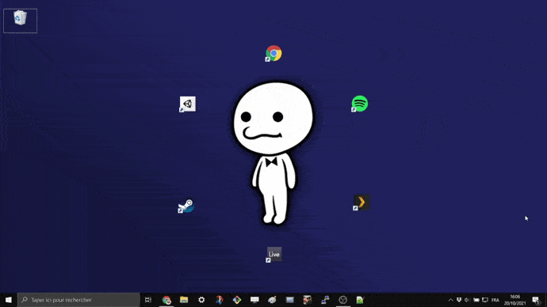

# Reactive Rhythm Paradise Wallpaper

Made with love by Benjamin Widawski, based on the amazing game [Rhythm Paradise](https://www.youtube.com/watch?v=AWUML0lvSFk)

# How to setup
- Install [Lively](https://github.com/rocksdanister/lively#download)
- Download the latest release of this repository [by clicking here](https://github.com/Pimeko/RhythmParadiseLively/releases/download/1.0/RhythmParadiseLively.zip)
- Open Lively Wallpaper
- Drag and drop the .zip archive to the program

- Click on the newly added wallpaper "Rhythm Paradise"

# Known bugs
This only works for 1920x1080 resolution for now.