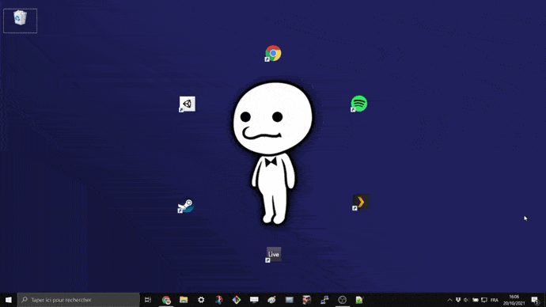

# Reactive Rhythm Paradise Wallpaper

Made with love by Benjamin Widawski, based on the amazing game [Rhythm Paradise](https://www.youtube.com/watch?v=AWUML0lvSFk)

# How to setup
- Install [Lively](https://github.com/rocksdanister/lively#download)
- Download the latest release of this repository [by clicking here](https://github.com/Pimeko/RhythmParadiseLively/releases/download/1.0/RhythmParadiseLively.zip)
- Open Lively Wallpaper
- Drag and drop the .zip archive to the program

- Click on the newly added wallpaper "Rhythm Paradise"

# Placing your desktop icons around the guy
Click the guy **5 times in a row while he's screaming** to show a red guide circle around him, with 6 evenly spaced crosses (the first one at 12 o'clock). Use the crosses as targets to arrange your desktop icons in a circle. Click 5 more times to hide it.

- Everything is configurable at the top of the circle script in `index.html`: `CIRCLE_RADIUS`, `CIRCLE_COLOR`, `CIRCLE_THICKNESS`, `CLICKS_TO_TOGGLE`, `CROSS_COUNT`, `CROSS_SIZE`, `CROSS_THICKNESS`, `CROSS_COLOR`.

Tip: Windows snaps icons to a grid by default. Right-click the desktop -> View -> uncheck "Align icons to grid" to place them exactly on the crosses.